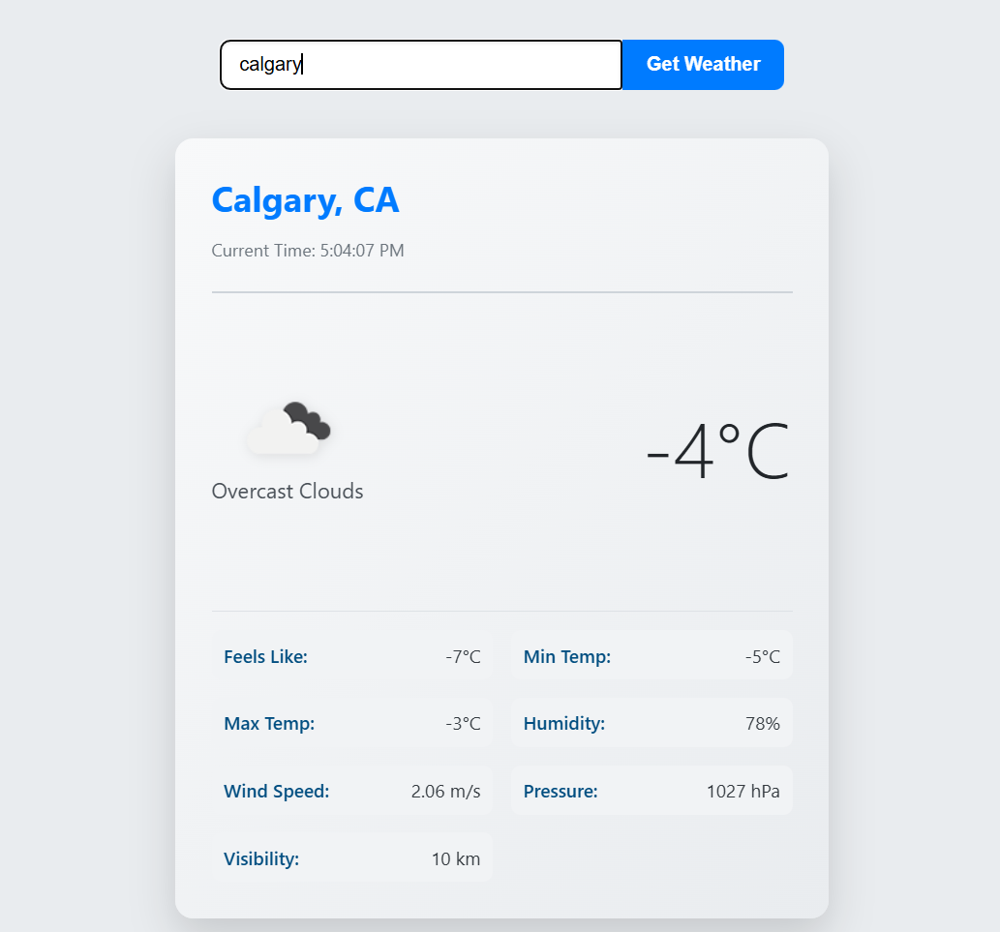
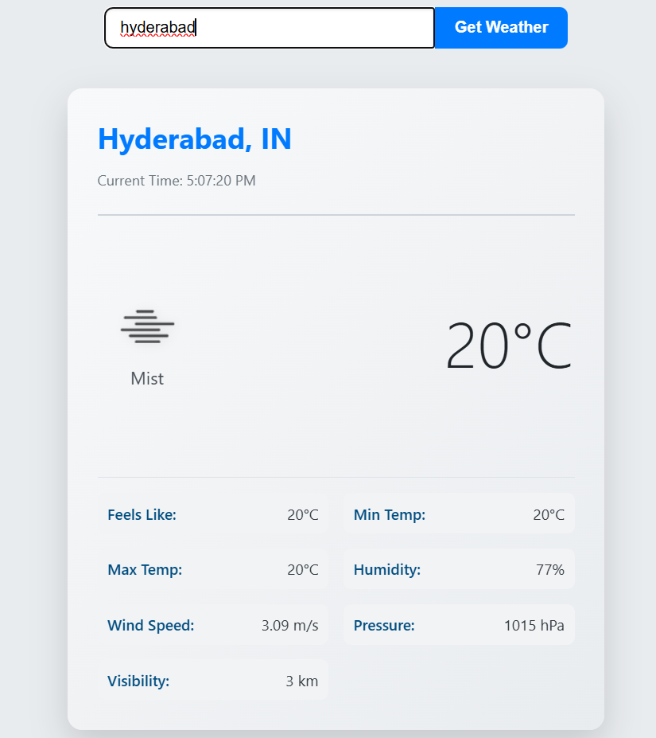
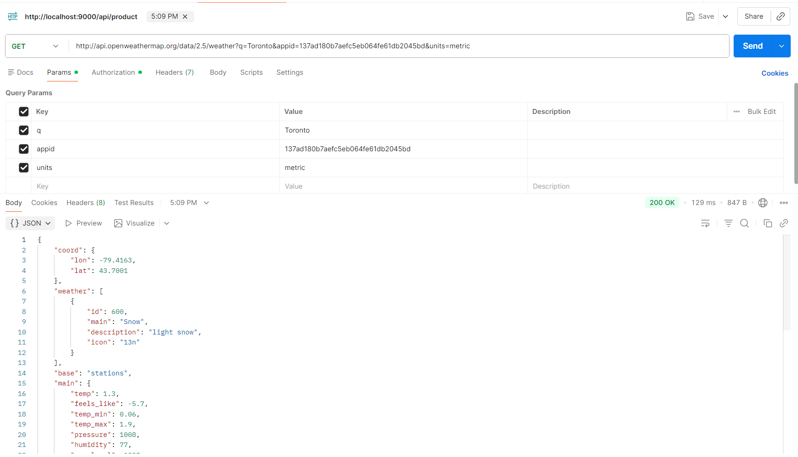

# 101504750_comp3123_labtest2 - React Weather App

## Project Description
This is a simple, user-friendly React application built for COMP 3123 Lab Test 2 to display the current weather for any city. It demonstrates API integration, state management, and props usage in React.

## API Used
The application fetches real-time data from the **OpenWeatherMap API** using the current-weather endpoint.

## Setup Instructions
1. Clone the repository.
2. Run `npm install` to install dependencies .
3. Run `npm start` to run the app in development mode.

## Core Features
* Dynamic search by city.
* Display of key details: temperature, condition, humidity, wind speed, pressure, etc.
* Use of weather icons based on API response.

## Screenshots

### 1. Calgary Weather Output!

### 2. Toronto Weather Output

### 3. Hyderabad Weather Output

### 4. postman 

## Notes
- The application uses `axios` for fetching API data.
- Temperature is displayed in Celsius (`units=metric`).